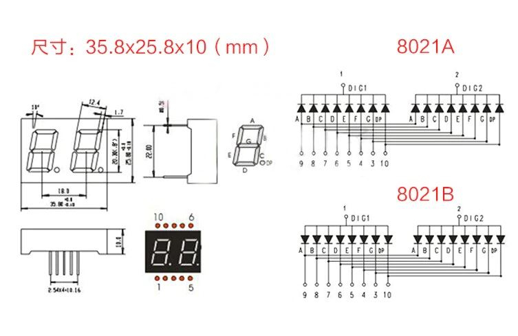
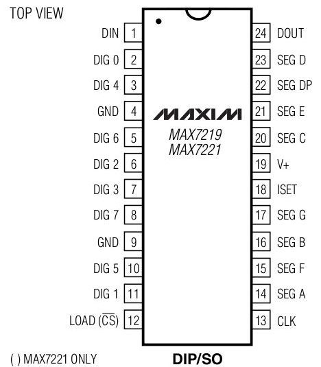
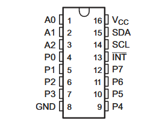

# ESP8266 + MAX7219CNG + Displays — Wiring Diagram

Wiring for a NodeMCU-style ESP8266 driving two MAX7219CNG driver
chips in a cascade: the first drives two 2-digit common-cathode
displays (Hadex K288Q / 220801K, schematic variant 8021A), the
second (chained via DOUT→DIN) drives two 4-digit common-cathode
displays (SH5461AS / K288G).

## Components

- ESP8266 dev board (NodeMCU-style, pins labeled D0–D8)
- 2x MAX7219CNG (24-pin DIP)
- 2x 220801K / 8021A 2-digit 7-segment display, common cathode
- 2x SH5461AS / K288G 4-digit 7-segment display, common cathode
- 2x resistor, 10 kΩ (one per MAX7219, sets segment brightness via ISET)
- 2x capacitor, 22 µF/25V electrolytic (one per MAX7219, decoupling
  — a 4700 µF/16V also works fine)

## 1. ESP8266 → MAX7219CNG

| MAX7219 pin | Function | ESP8266 pin | GPIO |
|---|---|---|---|
| 1 | DIN | D7 | GPIO13 |
| 13 | CLK | D5 | GPIO14 |
| 12 | LOAD/CS | D4 | GPIO2 |
| 4, 9 | GND | GND | — |
| 19 | V+ | VIN (5V) | — |
| 18 | ISET | via 10 kΩ resistor → V+ | — |

## 2. MAX7219CNG → Display (220801K / 8021A)

Pin numbering as seen from the **front** (digits facing you, decimal
points pointing down): bottom row left→right 1–5, top row left→right
10–6.

Both displays share the same confirmed pinout (second display
mirrors the first, just on DIG4/DIG5 for the commons):

| Display pin | Function | 1st display: MAX7219 pin | 2nd display: MAX7219 pin |
|---|---|---|---|
| 1 | COM1 (left digit, common cathode) | 2 (DIG0) | 3 (DIG4) |
| 2 | COM2 (right digit, common cathode) | 11 (DIG1) | 10 (DIG5) |
| 3 | Segment G | 17 (SEG G) | 17 (SEG G) — shared |
| 4 | Segment F | 15 (SEG F) | 15 (SEG F) — shared |
| 5 | Segment E | 21 (SEG E) | 21 (SEG E) — shared |
| 6 | DP (decimal point) | 22 (SEG DP) | 22 (SEG DP) — shared |
| 7 | Segment A | 14 (SEG A) | 14 (SEG A) — shared |
| 8 | Segment B | 16 (SEG B) | 16 (SEG B) — shared |
| 9 | Segment C | 20 (SEG C) | 20 (SEG C) — shared |
| 10 | Segment D | 23 (SEG D) | 23 (SEG D) — shared |

## 4. MAX7219CNG #1 → MAX7219CNG #2 (cascade)

| MAX7219 #1 pin | Function | → MAX7219 #2 pin |
|---|---|---|
| 24 (DOUT) | serial data out | 1 (DIN) |
| 13 (CLK) | clock | 13 (CLK) — parallel, same wire from ESP8266 |
| 12 (LOAD/CS) | select | 12 (LOAD/CS) — parallel, same wire from ESP8266 |
| 19 (V+) | power | 19 (V+) — same power rail |
| 4, 9 (GND) | ground | 4, 9 (GND) — same ground |
| — | ISET resistor | pin 18 (ISET) of chip #2 → own 10 kΩ resistor → pin 19 (V+) of chip #2 |
| — | decoupling capacitor | between pin 19 (V+) and pins 4/9 (GND) of chip #2, as close to its body as possible — its own capacitor, not shared with chip #1 |

## 5. MAX7219CNG #2 → Display A (first SH5461AS / K288G, digits 1–4)

Confirmed via segment-by-segment test (pin 5 → Segment G predicted
from the pattern, not individually confirmed).

| Display A pin | Function | MAX7219 #2 pin |
|---|---|---|
| 12 | DIG1 (1st digit) | 2 (DIG0) |
| 9 | DIG2 (2nd digit) | 11 (DIG1) |
| 8 | DIG3 (3rd digit) | 6 (DIG2) |
| 6 | DIG4 (4th digit) | 7 (DIG3) |
| 11 | Segment A | 14 (SEG A) |
| 7 | Segment B | 16 (SEG B) |
| 4 | Segment C | 20 (SEG C) |
| 2 | Segment D | 23 (SEG D) |
| 1 | Segment E | 21 (SEG E) |
| 10 | Segment F | 15 (SEG F) |
| 5 | Segment G | 17 (SEG G) |
| 3 | DP (decimal point) | 22 (SEG DP) |

## 6. MAX7219CNG #2 → Display B (second SH5461AS / K288G, digits 5–8)

Confirmed via segment-by-segment test on the replacement unit
(pin 5 → Segment G not individually confirmed, kept as the pattern
predicts).

| Display B pin | Function | MAX7219 #2 pin |
|---|---|---|
| 12 | DIG1 (5th digit) | 3 (DIG4) |
| 9 | DIG2 (6th digit) | 10 (DIG5) |
| 8 | DIG3 (7th digit) | 5 (DIG6) |
| 6 | DIG4 (8th digit) | 8 (DIG7) |
| 11 | Segment A | 14 (SEG A) — shared with display A |
| 7 | Segment B | 16 (SEG B) — shared with display A |
| 4 | Segment C | 20 (SEG C) — shared with display A |
| 2 | Segment D | 23 (SEG D) — shared with display A |
| 1 | Segment E | 21 (SEG E) — shared with display A |
| 10 | Segment F | 15 (SEG F) — shared with display A |
| 5 | Segment G | 17 (SEG G) — shared with display A |
| 3 | DP (decimal point) | 22 (SEG DP) — shared with display A |

## 7. Napájení (12V adaptér, HW-674, MOSFET moduly)

| Odkud | Kam |
|---|---|
| 12V adaptér (přes panelovou DC zdířku 5,5×2,5mm) | IN+ / IN− na HW-674 step-down měniči |
| 12V adaptér | zároveň VIN+ na obou MOSFET modulech (přímo, ne přes měnič) |
| HW-674 OUT+ (nastaveno na 5,0V!) | VIN na ESP8266 |
| HW-674 OUT− | GND na ESP8266 |
| GND (12V adaptér, oba MOSFET moduly, HW-674, ESP) | vše propojeno společně |

**Před připojením HW-674 k ESP** nastav trimr na desce tak, aby OUT+/OUT− ukazovalo přesně 5,0V (multimetr, bez ESP připojeného na výstupu).

## 8. ESP8266 → PCF8574A (I2C expander)

| PCF8574A pin | Číslo pinu (PDIP16) | Funkce | ESP8266 pin |
|---|---|---|---|
| VCC | 16 | napájení | 3.3V |
| GND | 8 | zem | GND |
| SDA | 15 | I2C data | D2 (GPIO4) |
| SCL | 14 | I2C hodiny | D1 (GPIO5) |
| A0 | 1 | adresa | GND |
| A1 | 2 | adresa | GND |
| A2 | 3 | adresa | GND |

Všechny adresní piny na GND → I2C adresa **0x38** (varianta "A").

## 9. Tlačítka a klíčový přepínač → PCF8574A

| Zařízení | Pin zařízení | PCF8574A pin | Číslo pinu (PDIP16) |
|---|---|---|---|
| Zelené tlačítko (spínač) | C | GND | 8 |
| Zelené tlačítko (spínač) | NO | P0 | 4 |
| Červené tlačítko (spínač) | C | GND | 8 |
| Červené tlačítko (spínač) | NO | P1 | 5 |
| Klíčový přepínač (pól 1) | C | GND | 8 |
| Klíčový přepínač (pól 1) | NO | P2 | 6 |

NC piny obou tlačítek i klíčového přepínače (pól 1) zůstávají nezapojené.
Druhý pól klíčového přepínače (C/NO/NC) zůstává zatím nezapojený,
rezervovaný pro budoucí použití.

## 10. LED podsvícení tlačítek (12V) → MOSFET moduly

| Součást | Pin | Kam |
|---|---|---|
| MOSFET modul (zelené LED) VIN+ | napájení | + pól 12V adaptéru |
| MOSFET modul (zelené LED) VIN− | zem | GND (společná zem) |
| MOSFET modul (zelené LED) PWM/IN | řídicí signál | D8 (GPIO15) na ESP |
| MOSFET modul (zelené LED) OUT+ | výstup | + pól LED zeleného tlačítka |
| MOSFET modul (zelené LED) OUT− | výstup | − pól LED zeleného tlačítka |
| MOSFET modul (červené LED) VIN+ | napájení | + pól 12V adaptéru |
| MOSFET modul (červené LED) VIN− | zem | GND (společná zem) |
| MOSFET modul (červené LED) PWM/IN | řídicí signál | D6 (GPIO12) na ESP |
| MOSFET modul (červené LED) OUT+ | výstup | + pól LED červeného tlačítka |
| MOSFET modul (červené LED) OUT− | výstup | − pól LED červeného tlačítka |